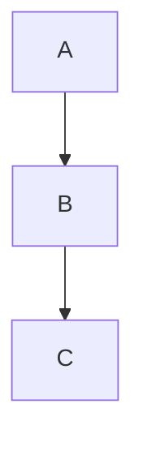

# Markdown 語法教學整理

---

## 標題

使用 `#` 來表示標題階層：

```markdown
# 一級標題
## 二級標題
### 三級標題
#### 四級標題
```

效果如下：

# 一級標題  
## 二級標題  
### 三級標題  
#### 四級標題  

---

## 文字特效

```markdown
**粗體文字**  
_斜體文字_  
_**粗體加斜體**_  
~~刪除線~~
```

效果如下：

**粗體文字**  
_斜體文字_  
_**粗體加斜體**_  
~~刪除線~~

---

## 列表

### 無序列表

```markdown
- 無序列表1
- 無序列表2
```

- 無序列表1  
- 無序列表2

### 有序列表

```markdown
1. 有序列表1
2. 有序列表2
```

1. 有序列表1  
2. 有序列表2

---

## 連結與圖片

### 連結

```markdown
[GitHub](https://github.com/yao6816)
```

👉 [GitHub](https://github.com/yao6816)

### 圖片

```markdown

```


也可以用 HTML 自訂圖片大小與對齊：

```html
<div align="center">
  
</div>
```

<div align="center">
  
</div>

---

## 引用

```markdown
> 這是一個引用區塊
>> 這是引用中的引用
```

> 這是一個引用區塊  
>> 這是引用中的引用  

---

## 程式碼區塊

使用三個反引號標示區塊：

<pre>
```python
var = 20
```
</pre>

效果如下：

```python
var = 20
```

---

## 流程圖（使用 Mermaid 語法）

<pre>

</pre>

效果如下：


