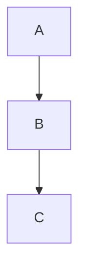

加入標題：
	# 一級標題<br>
	## 二級標題<br>
	### 三級標題<br>
	#### 四級標題<br>

# 一級標題
## 二級標題
### 三級標題
#### 四級標題

---
文字特效：<br>
	**粗體文字**<br>
	_斜體文字_<br>
	_**粗體加斜體**_<br>
	~~刪除線~~<br>

---
列表：
	無序列表：<br>
		- 無序列表1<br>
		- 無序列表2<br>
	有序列表：<br>
		1. 有序列表<br>
		2. 有序列表<br>

---
連結和圖片：<br>
	連結：<br>
		方括號放要顯示的文字，圓括號放連結<br>
		[GitHub](https://github.com/yao6816)<br>
	圖片：<br>
		和連結類似，在前方多加一個！<br>
		也可以用html來讓圖片縮小<br>
		
		<div align="center">
		
		</div>
		

---
引用：<br>
>會有一個引用的圖表出來
>>也可以在引用裡再引用
	
---
程式碼區塊：
```bash
	cd ~/Code/github
```

---
流程圖：

