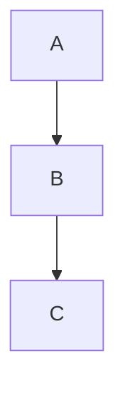

---

---

---
加入標題：
	# 一級標題
	## 二級標題
	### 三級標題
	#### 四級標題

# 一級標題
## 二級標題
### 三級標題
#### 四級標題

---
文字特效：
	**粗體文字**
	_斜體文字_
	_**粗體加斜體**_
	~~刪除線~~

---
列表：
	無序列表：
		- 無序列表1
		- 無序列表2
	有序列表：
		1. 有序列表
		2. 有序列表

---
連結和圖片：
	連結：
		方括號放要顯示的文字，圓括號放連結
		[GitHub](https://github.com/yao6816)
	圖片：
		和連結類似，在前方多加一個！
		也可以用html來讓圖片縮小
		
		<div align="center">
		
		</div>
		

---
引用：
	>會有一個引用的圖表出來
	>>也可以在引用裡再引用
	
---
程式碼區塊：
```python
	var = 20
```

---
流程圖：

